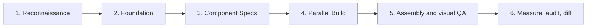

<div align="center">

# AI Website Cloner Template

### Clone any website with one command

Give your AI coding agent a URL and watch it recreate the website as a clean Next.js app.

**Best results with [Claude Code](https://docs.anthropic.com/en/docs/claude-code) + Opus 5. Works with Codex, Cursor, Gemini, and more.**

[](https://github.com/JCodesMore/ai-website-cloner-template/generate) [](https://discord.gg/hrTSX5yTpB)

[Quick Start](#quick-start) · [Watch Demo](#demo) · [Supported Platforms](#supported-platforms)

<a href="https://github.com/JCodesMore/ai-website-cloner-template/blob/master/LICENSE"></a> <a href="https://github.com/JCodesMore/ai-website-cloner-template"></a> 

  <a href="https://trendshift.io/repositories/24302?utm_source=repository-badge&amp;utm_medium=badge&amp;utm_campaign=badge-repository-24302" target="_blank" rel="noopener noreferrer"></a> <a href="https://www.star-history.com/jcodesmore/ai-website-cloner-template/"><picture><source media="(prefers-color-scheme: dark)" srcset="https://api.star-history.com/badge?repo=JCodesMore/ai-website-cloner-template&amp;theme=dark" /><source media="(prefers-color-scheme: light)" srcset="https://api.star-history.com/badge?repo=JCodesMore/ai-website-cloner-template" /></picture></a>

<br />
<sub><strong>SPONSORED BY</strong></sub>
<br /><br />
<a href="https://www.rapidproxy.io/?ref=JCM"></a>
<br />
<sub>Power your scraping and automation with 90M+ residential IPs, 500MB free traffic, and non-expiring bandwidth. <a href="https://www.rapidproxy.io/?ref=JCM">Explore RapidProxy →</a></sub>
<br /><br />
<a href="https://www.atlascloud.ai/?utm_source=github&amp;utm_medium=sponsor&amp;utm_campaign=ai-website-cloner-template">
  <picture>
    <source media="(prefers-color-scheme: dark)" srcset="docs/assets/sponsors/atlas-cloud-logo-white.svg" />
    <source media="(prefers-color-scheme: light)" srcset="docs/assets/sponsors/atlas-cloud-logo.svg" />
    
  </picture>
</a>
<br />
<sub>Generate AI images, video, audio, and 3D assets through one API. <a href="https://www.atlascloud.ai/?utm_source=github&amp;utm_medium=sponsor&amp;utm_campaign=ai-website-cloner-template">Explore Atlas Cloud →</a></sub>

</div>

---

## Demo

[](https://youtu.be/O669pVZ_qr0)

> Click the image above to watch the full demo on YouTube.

## Quick Start

> **Important:** Start by making your own copy with GitHub's **Use this template** button. Do not clone this template repository directly for your website project, and do not open pull requests here with your generated website.

1. **Create your own repository from this template**

   On the GitHub page for this project, click **Use this template**, then click **Create a new repository**.

   Give your new repository a name, choose whether it should be public or private, then click **Create repository**. If GitHub shows an **Include all branches** option, you can leave it off.

   This gives you your own separate project to work in, so your website changes stay in your account instead of coming back to the main template.

2. **Open your new repository on your computer**

   After GitHub creates your copy, open that new repository. Click **Code** and open or clone your new repository with your preferred coding tool.

   If you use the terminal, the command will look like this:

   ```bash
   git clone https://github.com/YOUR-USERNAME/YOUR-NEW-REPOSITORY.git
   cd YOUR-NEW-REPOSITORY
   ```

3. **Install dependencies**
   ```bash
   npm install
   ```
4. **Start your AI agent** — Claude Code recommended:
   ```bash
   claude --chrome
   ```
5. **Run the skill**:
   ```
   /clone-website <target-url1> [<target-url2> ...]
   ```
6. **Customize** (optional) — after the base clone is built, modify as needed

> Most supported clients expose `/clone-website` directly. If your client activates skills from natural-language requests, enter `Clone <target-url> using the clone-website workflow`. Project instructions are in `AGENTS.md`.

## Supported Platforms

| Agent                                                         | Status                     |
| ------------------------------------------------------------- | -------------------------- |
| [Claude Code](https://docs.anthropic.com/en/docs/claude-code) | **Recommended** — Opus 5   |
| [Codex CLI](https://github.com/openai/codex)                  | Supported                  |
| [OpenCode](https://opencode.ai/)                              | Supported                  |
| [GitHub Copilot](https://github.com/features/copilot)         | Supported                  |
| [Kiro](https://kiro.dev/)                                    | Supported                  |
| [Cursor](https://cursor.com/)                                 | Supported                  |
| [Windsurf](https://codeium.com/windsurf)                      | Supported                  |
| [Gemini CLI](https://github.com/google-gemini/gemini-cli)     | Supported                  |
| [Cline](https://github.com/cline/cline)                       | Supported                  |
| [Roo Code](https://github.com/RooCodeInc/Roo-Code)            | Supported                  |
| [Continue](https://continue.dev/)                             | Supported                  |
| [Amazon Q](https://aws.amazon.com/q/developer/)               | Supported                  |
| [Augment Code](https://www.augmentcode.com/)                  | Supported                  |

## Prerequisites

- [Node.js](https://nodejs.org/) 24+
- An AI coding agent (see [Supported Platforms](#supported-platforms))

## Tech Stack

- **Next.js 16** — App Router, React 19, TypeScript strict
- **shadcn/ui** — Base UI primitives + Tailwind CSS v4
- **Tailwind CSS v4** — oklch design tokens
- **Lucide React** — default icons (replaced by extracted SVGs during cloning)
- **Playwright** — first-party browser measurement for parity runs

## How It Works

The `/clone-website` skill runs a multi-phase bootstrap pipeline, then leaves
the result ready for repeatable parity revisits:



1. **Reconnaissance** — screenshots, design token extraction, interaction sweep (scroll, click, hover, responsive)
2. **Foundation** — updates fonts, colors, globals, downloads all assets
3. **Component Specs** — writes detailed namespaced spec files (`docs/research/<site-key>/<page-key>/components/`) with exact computed CSS values, states, behaviors, and content
4. **Parallel Build** — dispatches builder agents in git worktrees, one per section/component
5. **Assembly & visual QA** — merges worktrees, wires up the page, and compares the clone with the original
6. **Parity spine** — records immutable source/clone runs, audits dead controls and runtime classes, compares supported measurements, and keeps an append-only findings ledger

Parity findings identify source-vs-clone mismatches. Clone-health findings
identify clone implementation-quality observations. Clone-health findings do
not automatically block a parity milestone when source and clone intentionally
share a defect.

Each builder agent receives the full component specification inline — exact `getComputedStyle()` values, interaction models, multi-state content, responsive breakpoints, and asset paths. No guessing.

## Use Cases

- **Platform migration** — rebuild a site you own from WordPress/Webflow/Squarespace into a modern Next.js codebase
- **Lost source code** — your site is live but the repo is gone, the developer left, or the stack is legacy. Get the code back in a modern format
- **Learning** — deconstruct how production sites achieve specific layouts, animations, and responsive behavior by working with real code

## Not Intended For

- **Phishing or impersonation** — this project must not be used for deceptive purposes, impersonation, or any activity that breaks the law.
- **Passing off someone's design as your own** — logos, brand assets, and original copy belong to their owners.
- **Violating terms of service** — some sites explicitly prohibit scraping or reproduction. Check first.

## Project Structure

```
src/
  app/              # Next.js routes
  components/       # React components
    sites/<site-key>/
      shared/        # Shared same-site reconstructed UI
      <page-key>/    # Page-specific reconstructed UI
    ui/             # shadcn/ui primitives
    icons.tsx       # Extracted SVG icons
  lib/utils.ts      # cn() utility
  types/            # TypeScript interfaces
  hooks/            # Custom React hooks
public/
  sites/<site-key>/
    shared/          # Shared same-site assets
    <page-key>/      # Page-specific assets
docs/
  research/<site-key>/<page-key>/ # Namespaced extraction output & component specs
  research/<site-key>/_parity/    # Immutable parity runs, reports, and ledger
  design-references/<site-key>/<page-key>/ # Namespaced screenshots
scripts/
  sync-agent-rules.sh  # Regenerate agent instruction files
  sync-skills.mjs      # Regenerate /clone-website for all platforms
.kiro/skills/          # Generated Kiro workspace skill
.cline/skills/         # Generated Cline workspace skill
.roo/skills/           # Generated Roo Code workspace skill
.roo/commands/         # Generated Roo Code slash command
AGENTS.md           # Agent instructions (single source of truth)
CLAUDE.md           # Claude Code config (imports AGENTS.md)
GEMINI.md           # Gemini CLI config (imports AGENTS.md)
```

## Commands

```bash
npm run dev    # Start dev server
npm run build  # Production build
npm run lint   # ESLint check
npm run typecheck # TypeScript check
npm run check  # Run lint + typecheck + build
npm run cloner -- help # Exact parity CLI command reference
npm run test:cloner # Cloner instrument self-tests
```

### Revisit parity after the initial clone

Install Chromium once for Playwright when browser measurement is needed:

```bash
npx playwright install chromium
```

Measure the source and clone. Use a persistent profile for an authenticated
source, and keep it outside version control. The measurement commands print a
`runId`; assign those returned values before running the audits or diff:

```bash
npm run cloner -- measure --target source --url https://example.test --site example.test-01234567 --profile .cloner-profiles/primary --tenant tenant-a --role admin --inventory
npm run cloner -- measure --target clone --url http://127.0.0.1:3000 --site example.test-01234567 --inventory
# Use the concrete runId values returned by the two commands above.
SOURCE_RUN=20260914T120000Z_source_0123abcd
CLONE_RUN=20260914T120100Z_clone_89abcdef
npm run cloner -- audit dead-controls --site example.test-01234567 --target source --run "$SOURCE_RUN" --profile .cloner-profiles/primary
SOURCE_AUDIT=20260914T120200Z_audit-controls_2345bcde
npm run cloner -- audit dead-controls --site example.test-01234567 --target clone --run "$CLONE_RUN"
CLONE_AUDIT=20260914T120300Z_audit-controls_3456cdef
npm run cloner -- audit dead-classes --site example.test-01234567 --target clone --run "$CLONE_RUN"
npm run cloner -- diff --site example.test-01234567 --source "$SOURCE_RUN" --clone "$CLONE_RUN" --source-audit "$SOURCE_AUDIT" --clone-audit "$CLONE_AUDIT"
npm run cloner -- findings --site example.test-01234567
```

For a local credential-free browser smoke test of the complete fixture-backed
measure → audit → diff → ledger repair flow, run:

```bash
npm run test:cloner:integration
```

Every measurement creates a new immutable run at
`docs/research/<site-key>/_parity/runs/<run-id>/`. For read-side inspection,
`current` is optional shorthand that resolves immediately to the concrete
authoritative run ID in the target's current ref. For a durable revisit, copy
the concrete source and clone run IDs from the measurement output and pass
those IDs to audit/diff; reports and findings always persist concrete IDs. A
narrower rerun cannot overwrite an earlier broader run. See
[`tools/cloner/README.md`](tools/cloner/README.md) and
[`SECURITY.md`](SECURITY.md) for policy, redaction, and profile guidance.

### If using docker

```bash
docker compose up app --build # build and run the app
docker compose up dev --build # run the app in dev mode on port 3001
```

## Updating for Other Platforms

Two source-of-truth files power all platform support. Edit the source, then run the sync script:

| What                   | Source of truth                         | Sync command                       |
| ---------------------- | --------------------------------------- | ---------------------------------- |
| Project instructions   | `AGENTS.md`                             | `bash scripts/sync-agent-rules.sh` |
| `/clone-website` skill | `.claude/skills/clone-website/SKILL.md` | `node scripts/sync-skills.mjs`     |

Each script regenerates the platform-specific copies automatically. Agents that read the source files natively need no regeneration.


## Star History


## License

MIT

<sub>Translations: <a href="README.ja.md">日本語</a> · <a href="README.zh-CN.md">Simplified Chinese</a></sub>
